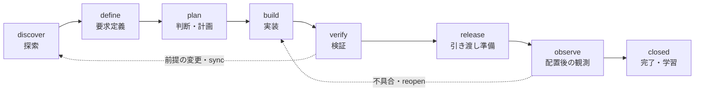

# KEEL

**不確実性を記録し、証拠で進路を決めるSDLCハーネス。**

あいまいな依頼から、要求の確認、設計、実装、検証、リリース、運用後の学習までを扱います。人やAIエージェントが判断と実装を担い、KEELが状態遷移・証拠の鮮度・実行予算を検査します。

Python 3.11以上。実行時の外部ライブラリ・APIキーは不要です。コマンド実行にはLinux / WSL / macOSのPOSIX環境を使います。ローカルでの検証環境はLinux / Python 3.12です。

## まず動かす

このリポジトリ内ではインストール不要です。

```bash
python3 -m sdlc --help
python3 -m examples.demo
make check
```

デモは新しい一時ディレクトリで、次を実際に実行します。

1. 「タイムアウトが0なら無制限か」という未決定事項でbuildを止める。
2. デモ用の要求確認記録を取り込み、解釈を確定する。
3. 欠陥のある実装のテストを失敗させる。
4. 実装を修正し、同じテストを成功させる。
5. 検証したファイルをローカルの配置先へコピーし、配置記録を登録する。
6. 観測時間後に配置先を検査し、振り返りとともにclosedに進む。

最後に、状態DB・実行ログ・リリースパケット・引き継ぎ文書の場所を表示します。デモの要求確認とレビューは模擬記録であることを明示しています。

## 何を制御するか

| 問題 | KEELの振る舞い |
|---|---|
| 要求があいまい | 受け入れ条件、対象外、意思決定者をゲートで要求 |
| 前提が未確認 | 問い・影響・根拠・戻しやすさ・調査・期限を台帳化 |
| 全体が止まりそう | 未解決事項の影響を受けないスライスを候補として提示 |
| 高リスクの仮説を先送り | 影響4以上／不可逆の未決定事項は遅くともbuildで停止 |
| 誤った前提が判明 | `refuted`で進行を止め、契約の修正と再計画を要求 |
| 古い成功結果を流用 | 契約・設定・ソース・成果物・実行環境の指紋と有効期限を照合 |
| 後の失敗を無視 | 各チェックの最新の試行を評価。失敗・実行中・中断を成功扱いしない |
| テストが暴走 | 回数・時間・試行数を実行前に予約し、時間と出力を制限 |
| エージェントが中断／競合 | SQLiteトランザクション、世代番号、実行予約、再読込可能な履歴 |
| リリース後の確認が抜ける | パケットと配置記録を照合し、観測期間後の結果と振り返りを要求 |

## 開発工程



`advance`は一段ずつ進みます。ゲートは累積的で、後工程でも以前の必須条件を検査します。`sync`は変更した契約を取り込み、discoverへ戻します。コードだけの変更は工程を巻き戻さず、関連する証拠を失効させます。

## 自分のリポジトリに導入する

KEELを仮想環境へインストールすると`keel`コマンドを使えます。

```bash
python3 -m venv .venv
.venv/bin/python -m pip install .
.venv/bin/keel --root /path/to/project init
.venv/bin/keel --root /path/to/project new feature --intent "実現したい利用者の成果"
```

インストールを伴わない使い方もできます。

```bash
PYTHONPATH="$PWD" python3 -m sdlc --root /path/to/project init
```

1. `.sdlc/config.json`に実行可能なチェックを登録する。`argv`は配列です。
2. `.sdlc/changes/feature/change.json`に要求・不確実性・判断・作業スライスを記入する。
3. `keel sync feature`で構造と参照関係を検証する。
4. `keel next feature`に従い、調査・実装・チェック・証拠登録を進める。

例となる契約は[timeout.change.json](examples/timeout.change.json)、対応設定は[timeout.config.json](examples/timeout.config.json)です。対象アプリに合う受け入れ条件とコマンドへ置き換えてください。初期設定はチェックを登録しないため、存在しないテストの成功を作りません。

エージェントには[導入用の作業規約](templates/AGENTS.fragment.md)と[作業プロトコル](docs/agent-protocol.md)を渡します。既存の`AGENTS.md`には必要な内容を統合してください。

設定と契約をGitで共有した場合、新しいチェックアウトでは`keel init --adopt`でローカルDBを作り、`keel import .sdlc/changes/feature/change.json`で契約を登録します。以前の成功証拠は作らず、discoverから始めます。

KEEL自身の開発項目を用意するには`python3 scripts/bootstrap.py`を使います。`--verify`を付けると実際の検証結果を保存してverifyまで進めます。レビューや配置記録は自動生成しません。

## 日常のループ

```bash
keel context feature
keel validate feature
keel sync feature
keel gate feature
keel run feature unit
keel advance feature --expect-revision 7
keel context feature --out .sdlc/changes/feature/context.md
```

`--expect-revision`の値は直前の`status --json`から取得します。上の`7`は書式例です。チェックの開始・終了も世代を更新するため、以前の値は再利用しません。

要求の解釈を確認した場合：

```bash
keel attest feature --kind research --scope contract \
  --file .sdlc/answer.md --actor "確認記録の作成者"
keel resolve feature U1 --evidence ev-<返されたID> \
  --outcome answered --answer "選択した解釈と根拠"
```

技術的な仮説に`check`を指定した場合、そのチェックの最新の成功記録を使います。低い影響の残余リスクは、根拠・責任者・代替策・有効期限を添えた`accepted`で明示できます。

## リリースと運用

```bash
keel gate feature --target release --json
keel packet feature
keel check-packet feature --file .sdlc/changes/feature/packet.json
# 組織のリリース基盤が、パケットの成果物を配置してreceipt.jsonを生成する
keel receipt feature --file .sdlc/receipt.json
keel advance feature
# 観測期間が経過してから実行
keel run feature health
keel attest feature --kind retrospective --file .sdlc/retrospective.md --actor "担当者"
keel advance feature
```

KEELは検証結果と引き渡す成果物を結び付けます。実際の外部デプロイや承認者の認証は、導入先のCI・保護環境・権限管理が担当します。`actor`はローカルの申告値です。[運用手順と接続契約](docs/operations.md)に境界と実装例を記載しています。

## 自動化向けの終了コード

| コード | 意味 |
|---:|---|
| 0 | コマンド成功。`status`は状態照会の成功を表す |
| 2 | ゲートが未達。`blockers`に理由と次の操作 |
| 3 | 入力・参照・世代・予算・保存状態などのエラー |
| 4 | 実行したチェックが成功以外で終了 |
| 130 | コマンドが割り込まれた。実行中のチェックが捕捉した割り込みは4 |

CIの合否には`gate`を使います。`status`や`validate`の成功はリリース可能という意味を持ちません。すべてのコマンドで`--json`を利用できます。

## ドキュメント

- [設計と不変条件](docs/architecture.md)：状態、証拠、トランザクション、ゲート。
- [不確実性の扱い](docs/uncertainty.md)：質問・実験・仮説・反証・残余リスク。
- [エージェントの作業プロトコル](docs/agent-protocol.md)：入力整理から引き継ぎまで。
- [運用・復旧・CI連携](docs/operations.md)：タイムアウト、クラッシュ、配置記録、バックアップ。
- [検証範囲と限界](docs/validation.md)：何をテストし、何を保証しないか。
- [設計の参考資料](docs/references.md)：採用した考え方と本実装の関係。

この実装は、根拠が不足した箇所を観測可能にし、失敗から進路を変えるための基盤です。実行コマンドやレビューの内容が要求を十分に検証しているかは、具体的なコードと受け入れ条件を見て判断します。
