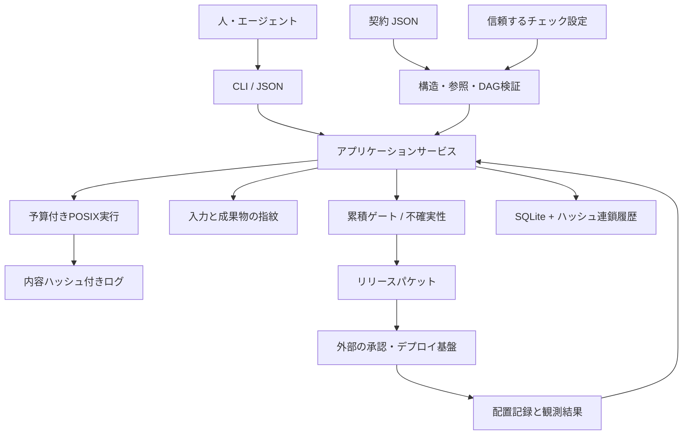

# 設計と不変条件

## 責任分担

人・エージェントが要求の意味、実験の適切さ、実装の品質を判断する。KEELは、その判断の記録と機械的に検証できる条件を管理する。モデルへのプロンプトだけで工程を守らせる構成から、決定的な制御層を分離した。



## 不変条件

1. `advance`が成功するときだけ、次の一工程へ進む。飛び越しはない。
2. 後工程のゲートは前工程の条件を含む。`closed`でも証拠が失効すれば現在の判定は未達になる。
3. 契約の変更は`sync`で明示的に取り込み、discoverへ戻す。古い履歴と使用済み予算は残す。
4. 各チェックの最新の試行を評価する。最新の失敗・中断・実行中を、古い成功で覆わない。
5. チェックの証拠は現在の契約・設定・ソース・成果物・実行環境と一致し、有効期限内で、ログの内容ハッシュが一致する必要がある。
6. 重大な未解決事項を、確信度の自己申告や残余リスクの受容だけで通さない。
7. 実行予算を子プロセスの起動前に予約する。クラッシュした試行も予算を消費する。
8. 状態更新と履歴追加は同じトランザクションに入れる。世代を指定した更新は競合時に失敗する。
9. 外部配置の記録は、その時点の証拠と成果物にひも付いたパケットを参照する。
10. 観測期間の経過だけで古い観測を合格に変えない。期間後に開始されたチェックを必要とする。

## ゲートの内容

| 遷移先 | 追加される条件 |
|---|---|
| define | 責任者、対象範囲、対象外、要求、受け入れ条件 |
| plan | 未決定事項の責任者・調査・代替策。中／高リスクなら設計判断。判断には代替案と復旧策 |
| build | スライス、要求→スライス→チェックの参照整合性、振る舞いを検証するtest、各スライスの復旧策 |
| verify | 設定したソース範囲に実体が存在する |
| release | 必須チェックの最新の証拠、配置・停止・復旧計画、成果物、観測計画。中／高リスクはレビュー記録。高リスクはsecurityとrollbackチェック |
| observe | 現在のパケットと一致する成功した配置記録 |
| closed | 観測期間の経過後に開始された観測チェックと振り返り |

不確実性の期限は全ゲートで検査する。`impact >= 4`または不可逆の事項は、指定が遅くてもbuildが期限になる。他の未解決事項もreleaseを越えて持ち越せない。`refuted`は、契約の修正が行われるまで全前進ゲートを止める。

`risk=low`でも宣言した要求は全件検証する。`priority=should`は優先順位であり、合格条件の免除ではない。延期するときは契約を修正して`sync`する。不可逆のリリース・判断、影響4以上／不可逆の未決定事項は、全体の実効リスクをhighへ引き上げる。

## 入力と証拠の同一性

JSONはキー順・空白に依存しない正規化表現をSHA-256でハッシュ化する。ソース指紋はファイルの相対パス・内容ハッシュ・実行ビットを含む。mtimeだけの変更は失効理由にならない。

`source_roots`に実装、テスト、依存ロック、生成器、ビルド設定などを含める。ディレクトリ指定は再帰的に走査する。`.git`と`.sdlc`は内部用途として常に除外し、`exclude_dirs`はディレクトリ名に対して適用する。リリース成果物は除外設定にかかわらず個別にハッシュ化する。

ソース・成果物・管理パスのsymlinkは拒否する。外部入力はワークスペースへ明示的に展開する。実行時の指紋は、許可された環境変数の値、設定した実行ファイルの実体と内容、OS情報、ハーネスのPythonバージョンから作る。環境変数の値自体は状態DBへ保存しない。

| 証拠 | 有効性の依存先 |
|---|---|
| test・experiment等のチェック | 契約、設定、ソース／成果物、実行環境 |
| 通常のresearch | 上と同じ |
| `research --scope contract` | 契約、設定。要求の解釈だけに使用できる |
| review・retrospective・deployment | 契約、設定、ソース／成果物、実行環境 |

契約にひも付く要求確認は、その後の実装変更で繰り返し求めない。技術・環境・依存先の主張にはこの省略を認めない。指定したprobeチェックを、手書きの調査メモで代替することもできない。

チェックの前後で指紋が変わった場合、終了コードが0でも`invalidated`になる。ログは取り込み時のコピーを保存し、現在のファイルの内容ハッシュも照合する。有効期限は全体設定で定め、残余リスクの期限はそれ以下にする。

## 永続化と競合

`.sdlc/state.db`はSQLite WAL、`synchronous=FULL`、書込み待機10秒を使用する。状態は変更単位のJSON投影として保存し、すべてのイベントに更新後の状態を保持する。イベントは前のイベントのハッシュを含む。

`doctor`はSQLite検査、連番、世代番号、ハッシュ連鎖、履歴の再生結果と現在の投影の一致、保存した証拠ファイルを確認する。これは事故による破損の検出である。DB全体を書き換えられる主体に対する署名や外部監査の代替にはしない。

`--expect-revision`は、読んだ状態に対して更新するための楽観的競合制御である。同じ世代を読んだ二者の更新は一方だけ成功する。長いコマンド実行中はDBの書込みロックを保持せず、永続的な実行予約で同一ワークスペースの別チェック実行と工程更新を抑止する。複数ワーカーには別のチェックアウトとDBを割り当てる。

## 実行予算

`max_runs`、`max_seconds`、`max_attempts_per_check`は変更全体の上限。`sync`や`reopen`で使用済み予算を戻さない。チェックの最大時間と残り時間の小さい方を予約する。通常終了時は実測時間を上限以内で精算する。終了記録のない試行は予約した全時間を消費する。

この予算は監督するチェックの時間である。人の思考時間、モデルのトークン、CPU・メモリ・ネットワーク使用量の制限は含まない。これらは外部ランナーで制御する。

## ディレクトリ

```text
.sdlc/
  config.json                  # 信頼する実行設定。レビュー対象
  state.db                     # 状態・世代・実行予約・履歴
  evidence/                    # チェックログと取り込んだ記録
  changes/<id>/
    change.json                # 意図と契約。編集後にsync
    packet.json                # DBに保存したパケットの出力コピー
    context.md                 # 任意の引き継ぎ出力
```

小さなチームとローカル実行を基準にした設計である。イベントごとに状態を保存するため、大規模な長期利用では履歴サイズが増える。破壊的な自動圧縮をせず、変更単位で保管し、新しい仕事は新しい変更IDで始める。
